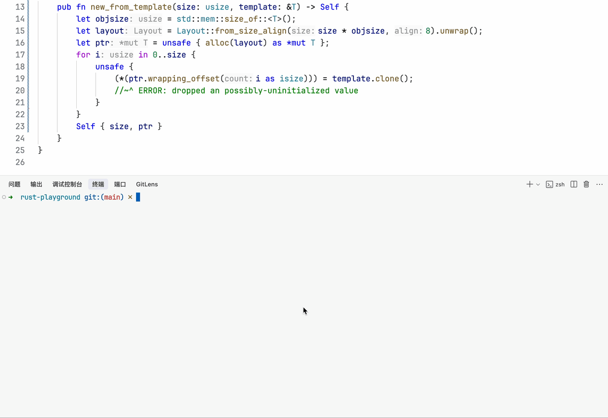

<p align="center">
  
</p>

# RPL

This is the main source code repository of RPL. It contains the toolchain and documentation of RPL.

## What is RPL?

RPL is a Rust linter which decouples the definition of rules from the detection logic.
In particular, RPL consists of two primary components:

- a Domain-Specific Language (DSL) that allows developers to model/define code patterns,
- a detection engine to detect instances of these patterns.

The toolchain of RPL, which is a custom configuration of Rust compiler, enables accurate identification of code instances that demonstrate semantic equivalence to existing patterns.

<p align="center">
  
</p>

## Quick Start

1. Clone the repository and enter the directory: `git clone https://github.com/RPL-Toolchain/RPL.git && cd RPL`

2. Install RPL as a cargo subcommand: `cargo install --path .`

3. Run RPL analysis on your Rust project:

   - check using built-in RPL pattern definitions based on inline MIR:

     ```sh
     RPL_PATS=/path/to/RPL/docs/patterns-pest cargo +nightly-2025-02-14 rpl
     ```

   - check using built-in RPL pattern definitions based on MIR:

     ```sh
     RUSTFLAGS="-Zinline-mir=false" RPL_PATS=/path/to/RPL/docs/patterns-pest cargo +nightly-2025-02-14 rpl
     ```

     or

     ```sh
     RPL_PATS=/path/to/RPL/docs/patterns-pest cargo +nightly-2025-02-14 rpl -- -Zinline-mir=false
     ```

   You can also store the environment variable `RPL_PATS` for convenience.
   
   Without setting `RPL_PATS`, built-in RPL pattern definitions are used.

   TIP: You can view all available lints with `cargo rpl -- -W help`.

## Documenting Patterns

You can generate Markdown documentation for any `.rpl` file with:

```sh
cargo rpl doc path/to/pattern.rpl
```

See [`docs/development/rpldoc-authoring.md`](./docs/development/rpldoc-authoring.md) for the authoring conventions (`//!` for file-level docs, `///` for items, and the sibling examples folder).

## RPL Book

See [this website](https://rpl-toolchain.github.io/rpl-book/) for the RPL book (Work in progress).

## Getting Help

Feel free to open an issue or contact us via email (stuuupidcat@163.com) if you have any questions.

## Contributing

See [this document](./CONTRIBUTING.md) for contribution-related instructions.

## License

This project is licensed under the [MPL-2.0](./LICENSE).
