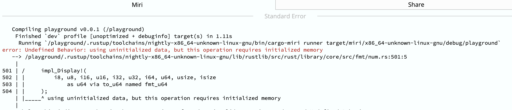

# CVE-2020-25016

## Metadata

- RustSec: https://rustsec.org/advisories/RUSTSEC-2020-0029.html
- Mitre: https://cve.mitre.org/cgi-bin/cvename.cgi?name=CVE-2020-25016
- Bug Report GitHub Issue/Release: https://github.com/kornelski/rust-rgb/issues/35
- Bug Fix GitHub Commit/PR: https://github.com/kornelski/rust-rgb/commit/2691083fa864200830bf9dce7fc890f594e3e402#diff-9840812fb9c7f79c8ca632cac5b636c957df758a020fe0b69065907aef725cdf
- A link to an encrypted external resource: https://www.yuque.com/frankking/wceyqq/vle0pchggci76pu3

## Source

```rust

pub trait ComponentSlice<T> {
    /// The components interpreted as an array, e.g. one `RGB` expands to 3 elements.
    ///
    /// It's implemented for individual pixels as well as slices of pixels.
    fn as_slice(&self) -> &[T];
    // /// The components interpreted as a mutable array, e.g. one `RGB` expands to 3 elements.
    // ///
    // /// It's implemented for individual pixels as well as slices of pixels.
    fn as_mut_slice(&mut self) -> &mut [T];
}

pub trait ComponentBytes<T: Copy + Send + Sync + 'static> where Self: ComponentSlice<T> {
    /// The components interpreted as raw bytes, in machine's native endian. In `RGB` bytes of the red component are first.
    #[inline]
    fn as_bytes(&self) -> &[u8] {
        let slice = self.as_slice();
        unsafe {
            core::slice::from_raw_parts(slice.as_ptr() as *const _, slice.len() * core::mem::size_of::<T>())
        }
    }
    // /// The components interpreted as raw bytes, in machine's native endian. In `RGB` bytes of the red component are first.
    #[inline]
    fn as_bytes_mut(&mut self) -> &mut [u8] {
        let slice = self.as_mut_slice();
        unsafe {
            core::slice::from_raw_parts_mut(slice.as_mut_ptr() as *mut _, slice.len() * core::mem::size_of::<T>())
        }
    }
}
```

## Description / Analysis

The trait `ComponentBytes` is unsound.

The generic type parameter `T: Copy + 'static` does not mean that the type T can be used as a slice. The factors that lead to unsoundness are as follows:

- The trait `ComponentBytes` is a public trait, allowing arbitrary external implementations.
- The trait `ComponentBytes` is a safe trait, with no bounds from any unsafe trait.
- The trait `ComponentBytes` contains the functions `fn as_bytes(&self) -> &[u8]` and `fn as_bytes_mut(&mut self) -> &mut [u8]`.

Given these, it can be concluded that the trait must be unsound.

### UB Caused by `fn as_bytes_mut(&mut self) -> &mut [u8]`

```Rust
pub trait ComponentSlice<T> {
    fn as_mut_slice(&mut self) -> &mut [T];
}

pub trait ComponentBytes<T: Copy + Send + Sync + 'static>
where
    Self: ComponentSlice<T>,
{
    #[inline]
    fn as_bytes_mut(&mut self) -> &mut [u8] {
        let slice = self.as_mut_slice();
        unsafe {
            core::slice::from_raw_parts_mut(
                slice.as_mut_ptr() as *mut _,
                slice.len() * core::mem::size_of::<T>(),
            )
        }
    }
}

impl<T> ComponentSlice<T> for [T] {
    fn as_mut_slice(&mut self) -> &mut [T] {
        self
    }
}
impl<T: Copy + Send + Sync + 'static, S: ?Sized + ComponentSlice<T>> ComponentBytes<T> for S {}

fn main() {
    let component: &'static str = "Hello";
    let mut not_rgb: [&str; 3] = [component; 3];

    // size_of::<[&str; 3]>() == 48
    
    let bytes = not_rgb.as_bytes_mut(); // convert three fat pointers to bytes

    println!("{:?}", bytes);
    bytes[0] += 10;                    // Apple M1 or Most ARM CPUs are Little Endian
    bytes[8] += 2;
    println!("{:?}", bytes);

    println!("not_rgb[0]: {}", not_rgb[0]);
    println!("not_rgb[1]: {}", not_rgb[1]);
    println!("not_rgb[2]: {}", not_rgb[2]);
} 
```

Output: 

```text
[
	0, 185, 167, 4, 1, 0, 0, 0, 5, 0, 0, 0, 0, 0, 0, 0, 
	0, 185, 167, 4, 1, 0, 0, 0, 5, 0, 0, 0, 0, 0, 0, 0, 
	0, 185, 167, 4, 1, 0, 0, 0, 5, 0, 0, 0, 0, 0, 0, 0
]
[
	10, 185, 167, 4, 1, 0, 0, 0, 7, 0, 0, 0, 0, 0, 0, 0,
    0, 185, 167, 4, 1, 0, 0, 0, 5, 0, 0, 0, 0, 0, 0, 0, 
    0, 185, 167, 4, 1, 0, 0, 0, 5, 0, 0, 0, 0, 0, 0, 0
]
not_rgb[0]: main.rs
not_rgb[1]: Hello
not_rgb[2]: Hello
```

### UB Caused by `fn as_bytes(&self) -> &[u8]`

```Rust

pub trait ComponentSlice<T> {
    fn as_slice(&self) -> &[T];
}

pub trait ComponentBytes<T: Copy + Send + Sync + 'static> where Self: ComponentSlice<T> {
    #[inline]
    fn as_bytes(&self) -> &[u8] {
        let slice = self.as_slice();
        unsafe {
            core::slice::from_raw_parts(slice.as_ptr() as *const _, slice.len() * core::mem::size_of::<T>())
        }
    }
}

impl<T> ComponentSlice<T> for [T] {
    fn as_slice(&self) -> &[T] { self } 
}

impl<T: Copy + Send + Sync + 'static, S: ?Sized + ComponentSlice<T>> ComponentBytes<T> for S {}

#[derive(Clone, Copy)]
#[repr(C)]
struct Pad(u8, u16);

fn main() {
    println!("{:?}", std::slice::from_ref(&Pad(0, 0)).as_bytes());
}
```

There is padding in the struct `Pad`, which causes using of uninitialized memory.

Byte | Content
----|------
  0 | u8
  1 | padding
  2 | u16(low)
  3 | u16(high)

The miri output is as follows:




## Fixes

Use an unsafe trait [Plain](https://crates.io/crates/plain) to mark `T` as a type that can be used as a slice.

## Pattern Description

Use a rustc function to check there is no unsafe trait in the generic type parameter's trait bounds.

> TODO: There are calls to `core::slice::from_raw_parts` in the `as_bytes` and `as_bytes_mut` functions.

````rpl
    mvar {
        T: ty
        m: mutability
        cast_from: span
        cast_to: span
    }
    util {
        p_ty: bound($T) = ```rustc
            |tcx: TyCtxt<'tcx>, predicates: ty::GenericPredicates<'tcx>, T: Ty<'tcx>| -> bool {
                /* ... */
            }
        ```
        p_fn = pub fn _(_) -> _ where $p_ty {
            #mir! {
                #span![$cast_from]
                let from_slice: & $m [$T] = _;
                let from_raw: *$m [$T] = &raw $m *from_slice;
                let from_len: usize = Len(*from_slice);
                let ty_size: usize = SizeOf($T);
                let to_len: usize = Mul(move from_len, move ty_size);
                let to_ptr: *$m u8 = from_raw as *$m u8 (PtrToPtr);
                let to_raw: *$m [u8] = *$m [u8] from (to_ptr, to_len);
                #span![$cast_to]
                let to_slice: &$m[u8] = &$m*to_raw;
            }
        }
    }

    patt {
        p = p_fn => UnsoundSliceCast {
            $cast_from,
            $cast_to,
            mutability: $m,
            ty: $T,
        }
    }

    diag {
        #[derive(Diagnostic)]
        #[diag(unsound_slice_cast)]
        pub struct UnsoundSliceCast<'tcx> {
            #[note]
            pub cast_from: Span,
            #[primary_span]
            pub cast_to: Span,
            pub ty: Ty<'tcx>,
            pub mutability: Mutability,
        }
    }

    msg {
        unsound_slice_cast = 
                it is unsound to cast any slice `&{$mutability}[{$ty}]` to a byte slice `&{$mutability}[u8]`
            .note = trying to cast from this value of `&{$mutability}[{$ty}]` type
    }
```