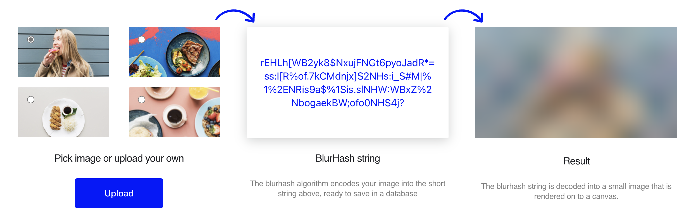

# CVE-2023-42447

## Metadata

- RustSec: \_
- Mitre: https://www.cve.org/CVERecord?id=CVE-2023-42447
- Bug Report GitHub Issue/Release: https://github.com/whisperfish/blurhash-rs/security/advisories/GHSA-cxvp-82cq-57h2
- Bug Fix GitHub Commit/PR: https://github.com/whisperfish/blurhash-rs/commit/91fd087c5531bd2b0fc7193c586c33be672dbf5a

## The function of the library



## Source

```rust
pub fn decode_into(
    pixels: &mut [u8],
    blurhash: &str,
    width: u32,
    height: u32,
    punch: f32,
) -> Result<(), Error> {
    /*  bug fix
        
        if !blurhash.is_ascii() {
            return Err(Error::InvalidAscii);
        } 
    
    */

    let quantised_maximum_value = base83::decode(&blurhash[1..2])?;

    ...

    for i in 0..colors.len() {
        if i == 0 {
            let value = base83::decode(&blurhash[2..6])?;
            colors[i] = dc::decode(value as u32);
        } else {
            let value = base83::decode(&blurhash[4 + i * 2..6 + i * 2])?;
            colors[i] = ac::decode(value as u32, maximum_value * punch);
        }
    }

    ...

    Ok(())
}
```

## Description / Analysis

In Rust, string indexing is based on bytes rather than characters. For strings containing non-ASCII characters, directly using slice operations may split a character's byte sequence, potentially leading to out-of-bounds access and causing a panic.

```Rust
fn main() {
    let s: &str = "我❤️中国";
    let c = &s[0..2];
    println!("{}", c);
}
```

output:

```Rust
thread 'main' panicked at src/main.rs:3:15:
byte index 2 is not a char boundary; it is inside '我' (bytes 0..3) of `我❤️中国`
```

## Pattern Description

TODO
