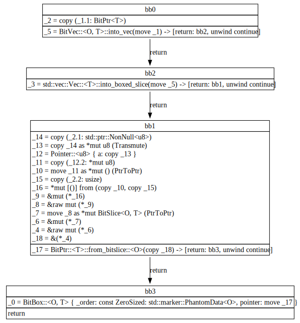

# CVE-2020-35862

## Metadata

- RustSec: https://rustsec.org/advisories/RUSTSEC-2020-0007.html
- Mitre: https://cve.mitre.org/cgi-bin/cvename.cgi?name=CVE-2020-35862
- Bug Report GitHub Issue/Release:
  - https://github.com/ferrilab/bitvec/issues/55
  - https://github.com/ferrilab/bitvec/commit/3ffe9510c3368555f96e5e96e0c1b90381d07cc9
  - https://github.com/mesalock-linux/bitvec-sgx/commit/b8c2ec36dce7aa57445cafba2c4bbb4ba2d664d0
- Bug Fix GitHub Commit/PR: https://github.com/ferrilab/bitvec/commit/3ffe9510c3368555f96e5e96e0c1b90381d07cc9

## Source

```rust
#[repr(C)]
pub struct BitVec<O = Local, T = usize>
where O: BitOrder, T: BitStore {
    /// Phantom `BitOrder` member to satisfy the constraint checker.
    _order: PhantomData<O>,
    /// Slice pointer over the owned memory.
    pointer: BitPtr<T>,
    /// The number of *elements* this vector has allocated.
    capacity: usize,
}

impl<O, T> BitVec<O, T>
where O: BitOrder, T: BitStore {
    pub fn into_boxed_bitslice(self) -> BitBox<O, T> {
        let pointer = self.pointer;
        //  Convert the Vec allocation into a Box<[T]> allocation
        mem::forget(self.into_boxed_slice());
        unsafe { BitBox::from_raw(pointer.as_mut_ptr()) }
        //  ^ Note that `BitBox::from_raw` is called with the pointer before the allocation
        //  | is converted into a `Box<[T]>`. This may be a bug if `Vec::into_boxed_slice`
        //  | moves the base address during resizing.
    }
    #[inline]
    pub fn into_boxed_slice(self) -> Box<[T]> {
        self.into_vec().into_boxed_slice()
    }
    pub fn into_vec(self) -> Vec<T> {
        let slice = self.pointer.as_mut_slice();
        let out = unsafe {
            Vec::from_raw_parts(slice.as_mut_ptr(), slice.len(), self.capacity)
        };
        mem::forget(self);
        out
    }
}
```

<!-- A `Vec` is converted into a `Box<[T]>` allocation, and then the `Box<[T]>` is converted into a `BitBox` allocation. The `Vec` is created from the `BitVec` by calling `into_vec()`, which creates a `Vec` from the `BitVec`'s pointer and capacity. The `Vec` is then converted into a `Box<[T]>` by calling `into_boxed_slice()`. The `Box<[T]>` is then converted into a `BitBox` by calling `BitBox::from_raw()` with the pointer of the `Box<[T]>`. -->

## Description / Analysis

Specifically, `BitBox` relied on an incorrect assumption that,`Vec::into_boxed_slice` never moved the base address during resizing.

```rust
pub fn into_boxed_slice(mut self) -> Box<[T], A> {
    unsafe {
        self.shrink_to_fit();
        let me = ManuallyDrop::new(self);
        let buf = ptr::read(&me.buf);
        let len = me.len();
        buf.into_box(len).assume_init()
    }
}
```

`shrink_to_fit()` shrinks the capacity of the vector as much as possible.

The behavior of this method depends on the allocator, which may either shrink the vector in-place or **reallocate**. The resulting vector might still have some excess capacity, just as is the case for with_capacity. See Allocator::shrink for more details.

## Fixes

```rust
impl<O, T> BitVec<O, T>
where O: BitOrder, T: BitStore {
    pub fn into_boxed_bitslice(self) -> BitBox<O, T> {
        let (_, head, bits) = self.bitptr().raw_parts();
        let boxed = self.into_vec().into_boxed_slice();
        let addr = boxed.as_ptr();
        mem::forget(boxed);
        unsafe {
            BitBox::from_raw(
                BitPtr::new_unchecked(addr, head, bits).as_mut_ptr(),
            )
        }
    }
}
```

## Pattern Description



As `BitVec::into_vec` cannot be inlined, one cannot inspect into the details

## References

- Shrink in raw_vec: https://doc.rust-lang.org/beta/src/alloc/raw_vec.rs.html#533
- Shrink in Allocator: https://doc.rust-lang.org/std/alloc/trait.Allocator.html#method.shrink
- Shrink in Vec: https://doc.rust-lang.org/std/vec/struct.Vec.html#method.shrink_to_fit
- A StackOverflow discussion: https://stackoverflow.com/questions/76308441/how-does-stdvecshrink-to-fit-work-in-rust
